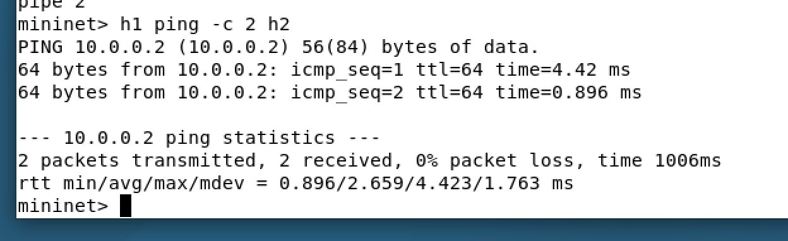

# ARP Handling in SDN Networks

## Problem Statement

In traditional networks, ARP (Address Resolution Protocol) relies on broadcast flooding, which is inefficient and does not scale well. In Software-Defined Networking (SDN), the controller has a global view of the network and can intercept ARP packets, generate intelligent ARP responses, enable host discovery, and validate communication — eliminating unnecessary broadcast traffic.

**Objectives:**
- Intercept ARP packets at the SDN controller level
- Generate ARP responses programmatically (proxy ARP)
- Enable automatic host discovery by learning IP-to-MAC mappings
- Validate end-to-end communication between hosts using ping and iperf

---

## Setup / Execution Steps

### Prerequisites

| Tool | Version / Notes |
|------|-----------------|
| Python | 3.6–3.9 recommended (POX compatibility) |
| Mininet | 2.3.x |
| POX Controller | 0.7.0 (gar) |
| Open vSwitch | Compatible with Mininet |
| Wireshark | For packet capture and analysis |
| iperf | For bandwidth testing |

---

### Step 1 — Start the POX Controller with ARP Handler

Open a terminal and navigate to the POX directory:

```bash
cd ~/pox
python3 pox.py forwarding.l2_learning misc.arp_handler
```

**Expected output:**

```
INFO:misc.arp_handler:ARP Handler Loaded
INFO:core:POX 0.7.0 (gar) is up.
INFO:openflow.of_01:[00-00-00-00-00-01 1] connected
INFO:misc.arp_handler:Switch connected
INFO:misc.arp_handler:Learned 10.0.0.1 -> 00:00:00:00:00:01
INFO:misc.arp_handler:Learned 10.0.0.2 -> 00:00:00:00:00:02
INFO:misc.arp_handler:Sent ARP reply for 10.0.0.1
```

> **Note:** If you are running Python 3.10+, POX may show a version warning. It is recommended to use Python 3.6–3.9 for full compatibility.

---

### Step 2 — Start Mininet Topology

Open a second terminal and start a basic Mininet topology:

```bash
sudo mn --controller=remote --topo=single,2
```

This creates a single switch (`s1`) with two hosts (`h1` at `10.0.0.1` and `h2` at `10.0.0.2`).

---

### Step 3 — Verify Flow Tables

After connecting, verify that the controller has installed flow entries on the switch:

```bash
sudo ovs-ofctl dump-flows s1
```

> Flow rules will be populated after the first ping/ARP exchange.

---

### Step 4 — Test Connectivity (Ping)

In the Mininet terminal, run a ping between the two hosts:

```bash
mininet> h1 ping -c 2 h2
```

**Expected output:**

```
64 bytes from 10.0.0.2: icmp_seq=1 ttl=64 time=4.42 ms
64 bytes from 10.0.0.2: icmp_seq=2 ttl=64 time=0.896 ms

--- 10.0.0.2 ping statistics ---
2 packets transmitted, 2 received, 0% packet loss, time 1006ms
rtt min/avg/max/mdev = 0.896/2.659/4.423/1.763 ms
```

---

### Step 5 — Test Unreachable Host

Ping a non-existent host to validate that unreachable hosts return proper ICMP errors:

```bash
mininet> h1 ping -c 2 10.0.0.99
```

**Expected output:**

```
From 10.0.0.1 icmp_seq=1 Destination Host Unreachable
From 10.0.0.1 icmp_seq=2 Destination Host Unreachable

--- 10.0.0.99 ping statistics ---
2 packets transmitted, 0 received, +2 errors, 100% packet loss, time 1033ms
```

---

### Step 6 — Bandwidth Test (iperf)

Run an iperf test to measure the throughput between h1 and h2:

```bash
mininet> h1 iperf -s &
mininet> h2 iperf -c 10.0.0.1
```

**Expected output:**

```
Client connecting to 10.0.0.1, TCP port 5001
TCP window size: 85.3 KByte (default)
[ 1] local 10.0.0.2 port 39446 connected with 10.0.0.1 port 5001
[ ID] Interval       Transfer     Bandwidth
[  1] 0.0000-10.0048 sec  148 GBytes  127 Gbits/sec
```

---

### Step 7 — Capture ARP Packets with Wireshark

Start Wireshark on the relevant interface before running ping, then filter by `arp` to observe the ARP exchange.

---

## Expected Output

### 1. POX Controller — ARP Learning

The controller intercepts ARP requests, learns host IP-to-MAC mappings, and generates ARP replies without broadcasting:

- Switch connects to the controller
- Host IP and MAC addresses are learned dynamically
- ARP replies are sent directly by the controller (proxy ARP)

---

### 2. Ping — Successful Communication

Pinging h2 from h1 completes with 0% packet loss, confirming that:
- ARP was resolved by the controller
- Flow rules were installed correctly
- ICMP packets are forwarded end-to-end

---

### 3. Ping — Destination Host Unreachable

Pinging a non-existent IP (10.0.0.99) results in 100% packet loss with ICMP "Destination Host Unreachable" errors, confirming that the controller correctly handles unknown hosts.

---

### 4. iperf — Bandwidth Measurement

The iperf test reports ~127 Gbits/sec (loopback/virtual environment), confirming that the data path established by the SDN controller is fully functional.

---

### 5. Flow Table — `ovs-ofctl dump-flows s1`

After the ping, flow rules are installed on the switch `s1`. The empty output shown before ping is expected — flow rules are populated dynamically by the controller after the first ARP/ICMP exchange.

---

## Proof of Execution — Screenshots

### Screenshot 1 — Successful Ping (h1 → h2)


Demonstrates 0% packet loss between h1 (10.0.0.1) and h2 (10.0.0.2), confirming ARP resolution and flow rule installation by the POX controller.

---

### Screenshot 2 — POX Controller with ARP Handler


Shows the POX controller running with `forwarding.l2_learning` and `misc.arp_handler` modules. The controller learns host mappings and sends ARP replies directly.

---

### Screenshot 3 — Ping to Unreachable Host (10.0.0.99)


Pinging a non-existent IP results in 100% packet loss with "Destination Host Unreachable" messages, validating correct ARP/ICMP error handling.

---

### Screenshot 4 — iperf Bandwidth Test


h2 connects to h1's iperf server and measures ~127 Gbits/sec throughput over 10 seconds, confirming the data path is fully operational.

---

### Screenshot 5 — Flow Table (`ovs-ofctl dump-flows s1`)


Output of `ovs-ofctl dump-flows s1` after the SDN controller connects to the switch. Flow entries are dynamically installed by the controller upon the first packet-in event.

---

### Screenshot 6 — Wireshark ARP Capture


Wireshark capture filtered on `arp` showing the complete ARP exchange:
- Frame 5: h1 broadcasts "Who has 10.0.0.2? Tell 10.0.0.1"
- Frame 6: Reply — 10.0.0.2 is at 00:00:00:00:00:02
- Frame 7: h2 queries "Who has 10.0.0.1? Tell 10.0.0.2"
- Frame 8: Reply — 10.0.0.1 is at 00:00:00:00:00:01
- Frame 9: Final ARP reply confirming 10.0.0.2's MAC

This confirms that ARP requests are intercepted and responded to by the SDN controller (proxy ARP).

---

## References

1. **POX SDN Controller Documentation** — [https://noxrepo.github.io/pox-doc/html/](https://noxrepo.github.io/pox-doc/html/)
2. **Mininet Project** — Lantz, B., Heller, B., & McKeown, N. (2010). *A network in a laptop: rapid prototyping for software-defined networks*. HotNets-IX. [http://mininet.org](http://mininet.org)
3. **OpenFlow Specification** — Open Networking Foundation. *OpenFlow Switch Specification, Version 1.0*. [https://opennetworking.org/wp-content/uploads/2013/04/openflow-spec-v1.0.0.pdf](https://opennetworking.org/wp-content/uploads/2013/04/openflow-spec-v1.0.0.pdf)
4. **RFC 826 — An Ethernet Address Resolution Protocol** — Plummer, D. C. (1982). [https://datatracker.ietf.org/doc/html/rfc826](https://datatracker.ietf.org/doc/html/rfc826)
5. **Wireshark User Guide** — [https://www.wireshark.org/docs/wsug_html_chunked/](https://www.wireshark.org/docs/wsug_html_chunked/)
6. **Open vSwitch Documentation** — [https://docs.openvswitch.org/en/latest/](https://docs.openvswitch.org/en/latest/)
7. **McCauley, J. et al.** *POX: A Python-based OpenFlow Controller*. [https://github.com/noxrepo/pox](https://github.com/noxrepo/pox)
